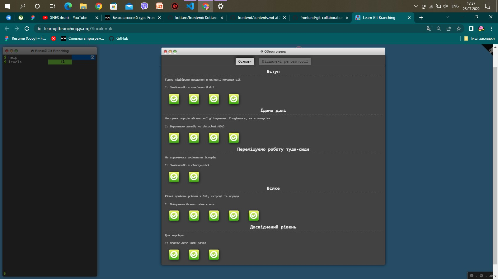
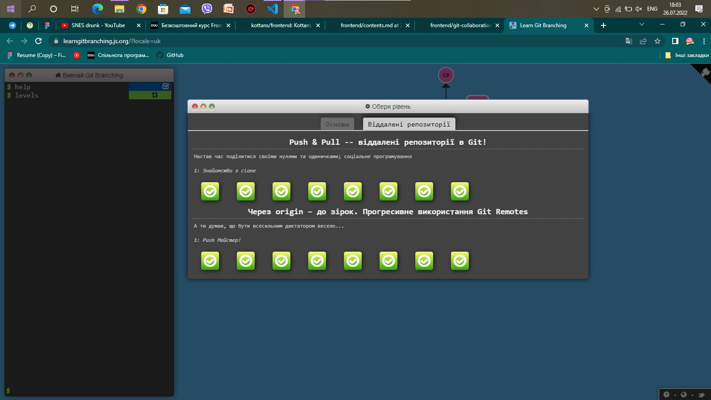
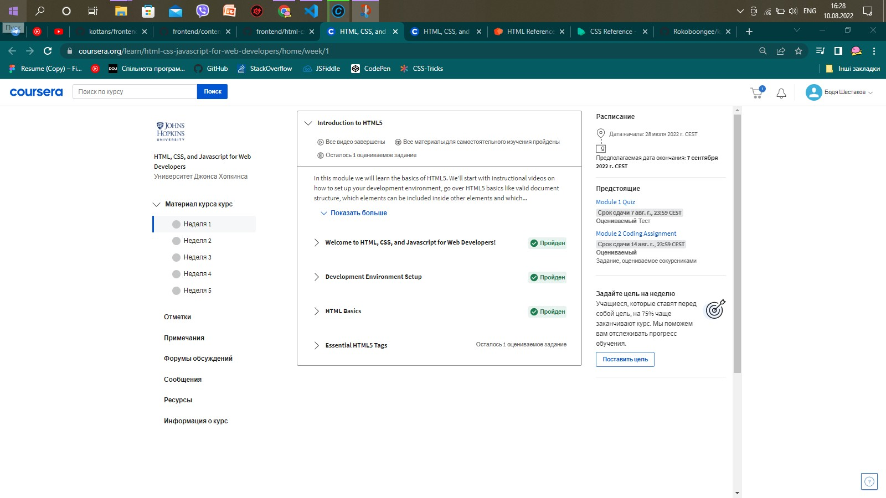
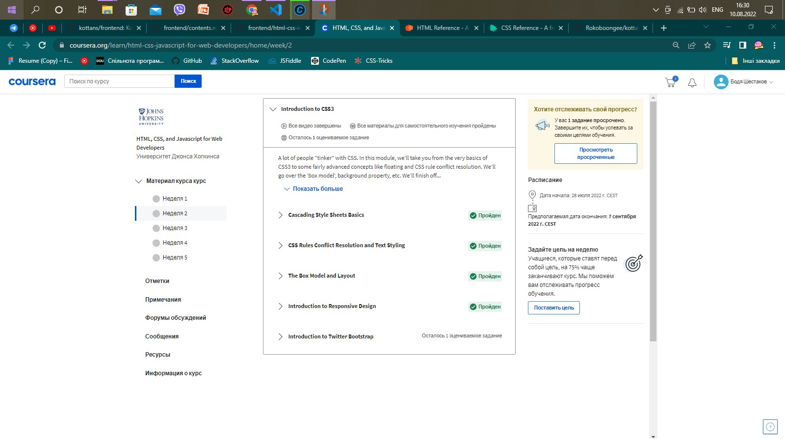

# ¡¡Hola

## Linux CLI, and HTTP

Закінчені питання

#### Перший тест

Нічого нового, усі команди завчив поки колупався у клятому інтерфейсі ГітБаш

#### Другий тест

Вже цікавіше, але не так багато нового

#### Третій тест

Точки, тільди і трясця ії матері несмішні жарти, та уривки із творчості Л. Керрола

#### Четвертий тест

Дуже чудово, щоб негайно припинити процесс треба поставити оцінку чи що?

## Git Collaboration

Виконані завдання з Git Branching

#### Основні завдання

Було б гарно якби контроль версій також був представленний візуально як у завданнях

#### Віддалені репозиторії

З практикою у майбутньому можливо буде круто використовувати фішки які були у завданнях

## HTML&CSS Intro

 Курс 1 та 2 тижня по HTML, CSS, and Javascript for Web Developers

Нічого нового

З СSS вже цікавіше, море простору для форматування сторінки так багато цікавих посилань

